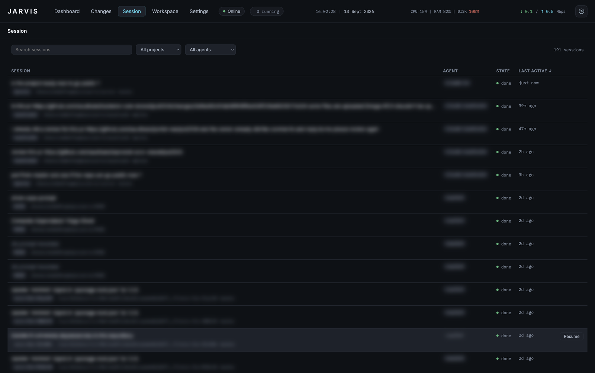
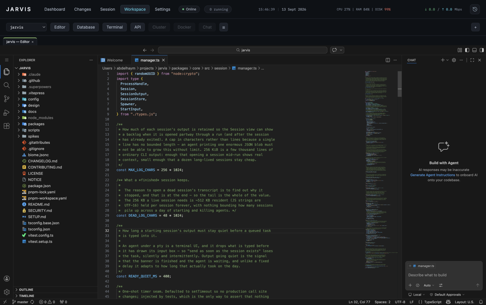
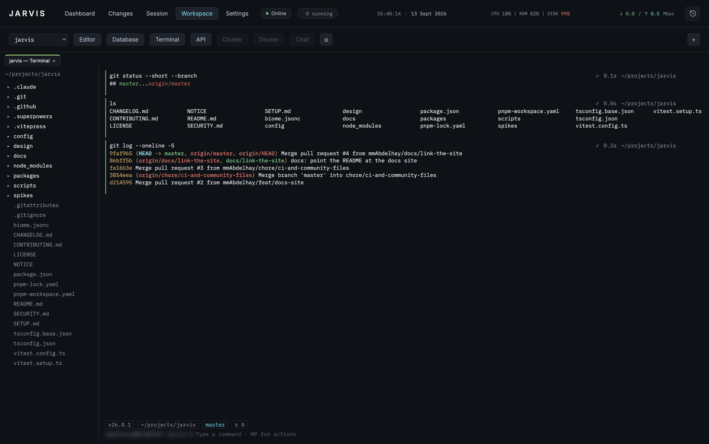

# Jarvis

A desktop workspace for running coding agents by voice, and for doing the work
around them without leaving it: the project's files, its databases, a shell in
it, and its APIs.

Jarvis is a single Electron app over a pnpm workspace. It runs on macOS,
Linux and Windows. It speaks Arabic and English, and it is built for one person on one
machine — there is no server, no account, and nothing leaves the laptop that
was not already going to. It opens full screen.

Everything in the Workspace belongs to a project, except the **Personal**
browser, which belongs to none: somewhere to keep tabs that are not work,
with its own logins and its own bookmarks.

```
⌥Space            talk to the brain, or to the session you are looking at
Dashboard         what every agent is doing, and what the machine is doing
Changes           the working tree, staged and committed from here
Session           one agent's real terminal
Workspace         a browser, an editor, a database client, a shell, an API client, a cluster browser
Settings          everything jarvis.yaml holds, edited in place
```

<p align="center">
  
</p>

<p align="center">
  <sub>The Dashboard. Project names, provider accounts and capacity figures are blurred — everything else is the running app.</sub>
</p>

## What it does

**Runs the agents.** Each agent is a real process under a real pty, not an API
call — its terminal is the terminal, and the Session route shows exactly what
it drew. The Dashboard reports what every one of them is doing at once, beside
what the machine has left to give them, and how much capacity each provider
account has before it resets.

**Listens.** ⌥Space talks to the brain, which resolves what you said against
the projects and sessions that actually exist, so "افتح متجر أكمي" reaches a
project keyed `acme`. Speak to a session instead and the words go to that
agent's stdin.

<p align="center">
  
</p>

<p align="center">
  <sub>Every session Jarvis has ever run, across every project. Prompts, project names and agent accounts are blurred — the table, the states and the timestamps are the running app.</sub>
</p>

**Comes with you.** A companion phone app pairs with the desktop over your
local network or a [Tailscale](https://tailscale.com/) tailnet: sessions,
terminals, changes, and the Editor / Database / Cluster tabs, from the
phone, over one authenticated TLS connection that is off by default. See
[Remote access](docs/guide/remote-access.md).

**Keeps the work in one window.** The Workspace opens a project's files in an
editor, its tables in a database client, its endpoints in an API client, its
cluster in a browser, and a shell rooted where the project is — each as an
ordinary tab beside the others.

<p align="center">
  
</p>

<p align="center">
  <sub>The Editor tab — code-server, in the window, on the project Jarvis is pointed at.</sub>
</p>

**The Terminal tab is Warp-shaped.** Each command and its output become an
addressable block you can collapse, copy, re-run or filter to the ones that
failed; a real editor sits at the prompt with history-ranked completion; the
pane splits; ⌘P reaches every action. A file sidebar follows the shell as it
`cd`s, and a row of chips above the input names the directory, the branch and
what is uncommitted. Re-run, workflows, history and the AI's suggestion all
*fill* the line — you press Enter yourself, always.

<p align="center">
  
</p>

<p align="center">
  <sub>The Terminal tab. Each block carries its own exit state, duration and working directory; the chips under the prompt name the Node version, the directory, the branch and what is uncommitted.</sub>
</p>

## Getting started

### Install the built app

**macOS** — grab the `.dmg` from the releases page, open it, and drag Jarvis
to Applications. Two things are worth knowing before you do:

- **Apple Silicon only.** The build is arm64; an Intel Mac cannot run it.
- **It is not signed by an identified developer**, so the first launch is
  refused with a warning that macOS cannot check it for malware. Open
  System Settings → Privacy & Security and press **Open Anyway**, or run
  `xattr -dr com.apple.quarantine /Applications/Jarvis.app`. This is what
  ad-hoc signing costs; nothing about the app changes either way.

**Android phone (optional)** — grab `jarvis-mobile-<version>.apk` from the
same releases page, install it on the phone, and pair from Settings →
Remote access on the desktop ([how](docs/guide/remote-access.md)).

**iPhone / iPad (optional)** — sideload `jarvis-mobile-<version>.ipa` from
the releases page with AltStore or SideStore and your own free Apple ID;
there is no App Store or TestFlight build (that needs Apple's $99/year
programme). Free signing means a 7-day refresh cycle (the tools automate
it) and no push notifications — everything else works. Full walkthrough:
**[iPhone and iPad](docs/guide/ios-install.md)**.

**Linux** — grab the `.AppImage`, make it executable, and run it. There is
nothing to install and no package manager involved:

```bash
chmod +x Jarvis-*.AppImage
./Jarvis-*.AppImage
```

**Windows** — grab the `.zip`, unpack it anywhere, and run `Jarvis.exe`. The
whole folder is the app; keep it together. There is no installer, which is
also why there is no SmartScreen prompt to click past — but the executable is
not Authenticode-signed either, so Windows may still ask once.

The Terminal tab runs PowerShell there, and the app's own chords are
Ctrl+Shift rather than ⌘ — the same spelling Linux uses. If another app holds
Alt+Space (PowerToys Run does, by default), Jarvis says so at startup and uses
Ctrl+Shift+Space instead; every hint in the app then names that.

- **x64 only.** arm64 needs an arm64 machine to build on; there isn't one yet.
- **Ubuntu 22.04 and later need `libfuse2`** (`sudo apt install libfuse2t64`),
  which is what mounts an AppImage. Without it, `./Jarvis-*.AppImage
  --appimage-extract-and-run` works instead.
- **Voice needs `ffmpeg` and a player** — see
  [installation](docs/guide/installation.md). Everything else works without
  them.

Jarvis writes `~/.config/jarvis/jarvis.yaml` on first run and opens with it,
so there is nothing to set up before the first launch. It also shows a setup
screen naming the external tools it can use, what each unlocks, and whether
you have it — installing the ones you tick. Nothing installs until you press
the button, and nothing needing root is ever run: those are shown as a command
to copy. It will report the
agent it cannot find until you install one — see
**[installation](docs/guide/installation.md)** for the external tools each
Workspace tab wants, all of them optional except the agent CLI itself.

### Or run it from source

New machine? **[SETUP.md](SETUP.md)** walks the whole thing, start to finish.

```bash
pnpm install
pnpm bootstrap                           # fetches Electron, builds node-pty
pnpm --filter @jarvis/desktop start      # builds, then opens the app
pnpm --filter @jarvis/desktop package    # builds for whichever platform this is
```

`pnpm bootstrap` is not optional and is not a convenience. This workspace runs
with install scripts disabled on purpose, which leaves two things undone that
the app cannot run without: the Electron binary is never downloaded, and
node-pty's native binding is never built. node-pty ships no Linux prebuild at
all, so on Linux that second step is a compile and wants `build-essential` and
`python3`. Run it once after every `pnpm install`.

Each platform is packaged on itself — `--linux` from a Mac would wrap a darwin
Electron in a Linux bundle without complaining, and node-pty's binding has to
be compiled by the machine that ships it.

Configuration lives at `~/.config/jarvis/jarvis.yaml`. Jarvis writes a
starting one on first run, reads it at startup, and the Settings route writes
it back. See **[the configuration
guide](docs/guide/configuration.md)** for what every key does, and
**[installation](docs/guide/installation.md)** for the handful of external
tools each Workspace tab needs.

## Documentation

All of it is also a site, with search across every page:
**[mmabdelhay.github.io/jarvis](https://mmabdelhay.github.io/jarvis/)**. The same
files, rendered — so the links below work whether you read them here or there.

**Using it**

- [Setup](SETUP.md) — a new machine, start to finish
- [Installation](docs/guide/installation.md) — prerequisites, first run, what each optional tool unlocks
- [Configuration](docs/guide/configuration.md) — every key of `jarvis.yaml`, with worked examples
- [The routes](docs/guide/routes.md) — Dashboard, Changes, Session, Workspace, Settings
- [Workspace tabs](docs/guide/workspace-tabs.md) — browser, Editor, Database, Terminal, API
- [The API client](docs/guide/api-client.md) — collections, environments, scripts, auth, cookies
- [Remote access](docs/guide/remote-access.md) — pairing the phone app, Tailscale, certificates, the audit log
- [Troubleshooting](docs/guide/troubleshooting.md) — what breaks, and what it means

**Working on it**

- [Architecture](docs/develop/architecture.md) — the four packages and what may import what
- [Conventions](docs/develop/conventions.md) — the rules this codebase enforces, and why each exists
- [Testing](docs/develop/testing.md) — what is tested where, and what tests cannot see
- [Adding a Workspace tab](docs/develop/adding-a-tab.md) — the pattern, end to end
- [Contributing](CONTRIBUTING.md) — what CI checks, and how a change is expected to arrive
- [Security](SECURITY.md) — what is in scope, and where to report privately
- [Changelog](CHANGELOG.md) — what each release changed

## Commands

| | |
|---|---|
| `pnpm lint` | Biome: formatting and rules, warnings included |
| `pnpm lint:fix` | apply everything Biome can fix itself |
| `pnpm test` | the whole suite |
| `pnpm typecheck` | `tsc -b` across the workspace |
| `pnpm bootstrap` | fetch the Electron binary, build node-pty |
| `pnpm prereqs` | report the external tools; `--all` installs them |
| `pnpm --filter @jarvis/desktop build` | compile and copy vendored assets |
| `pnpm --filter @jarvis/desktop start` | build, then run |
| `pnpm --filter @jarvis/desktop package` | package for this platform |

The build step matters: the renderer's vendored libraries and the app icon are
copied into `dist/` by a script, not by `tsc`. Running `tsc` alone leaves them
stale.

## How it is built

Four packages, and the rule that keeps them apart: `core` holds the logic and
imports nothing from the others; `platform` owns everything that touches the
machine — processes, ptys, git, the filesystem; `remote` is the remote
bridge's transport and imports only `core`; `desktop` is Electron's main
process and the renderer, and it is the only one allowed to know about the
others.
[Architecture](docs/develop/architecture.md) states what may import what and
why the boundary is worth having.

Almost 2,900 tests run in a few seconds because the parts that hold the logic
take their I/O injected: a splitter that cuts a pty stream into blocks is a
pure function over chunks, a completion engine is a pure function over history,
and the code that spawns and reads is small and separate. What tests cannot
see — how it looks, whether a terminal reflows, whether a real shell behaves —
is written down in [testing](docs/develop/testing.md) rather than assumed.

Features arrive by the same route each time: a design argues for the shape,
a plan breaks it into reviewable pieces, and each piece is written test-first
and read by a fresh reviewer before the next begins.

## What it exposes

Jarvis is built for one person on one machine, and most of it touches no
network at all. Five things are worth knowing before you run it somewhere
shared.

**The Database tab is reachable from your network while it is open.**
DbGate always listens on `0.0.0.0` and offers no bind-address option, so an
open Database tab is reachable from any machine that can reach yours. It is
guarded by a per-spawn random password — the desktop's own Database tab now
logs itself in with it automatically (`BASIC_AUTH=1`, answered through
Electron's `login` event), so the password no longer needs to be read off
the status line there, but it is still the only thing standing between your
databases and everyone else on the network: the instance still binds every
interface and stops only when the tab closes. On a café or office network,
that password is the whole of your protection.

**The Editor tab runs without authentication, on loopback only.**
`code-server` is started with `--auth none` bound to `127.0.0.1`, so nothing
outside this machine's own processes can reach it — except through the
sidecar proxy below, which fronts it with a per-device cookie for a paired
phone.

**Agents run as you.** Every session is a real process under a real pty with
your environment, your PATH and your credentials — that is what the app is
for, and it is worth saying out loud. Jarvis adds no sandbox of its own.

**The mobile remote bridge is off by default, and reachable only on purpose.**
It never listens unless `remote.enabled` is turned on *and* either a device
is already paired or a pairing window is open, and only on the one address
`remote.bindAddress` names (loopback by default) — never every interface
unless you explicitly configure that. When it does listen, it speaks TLS 1.3
to a certificate the phone pins, or, with a named certificate, trusts by
name on first pairing, and pairing itself needs a second step on this
machine: a confirmation dialog naming the requesting device, which you
approve or deny. Once paired, that phone can run commands on this machine
as you, exactly like an agent session — see "Agents run as you" above — so
treat a paired phone the way you would treat a second person with your
terminal. With the laptop's self-signed default certificate, or a
configured certificate with no DNS name, the phone pins that exact
certificate at pairing time; a key-pair regeneration changes the
fingerprint and every phone paired that way has to pair again. With a
*configured* certificate that carries a DNS name
(`remote.tls.certPath`/`keyPath`, e.g. from `tailscale cert`), the pairing
link carries that name instead, and the phone trusts it through the OS's own
trust store rather than pinning it — a renewal under the same name needs
only a bridge restart (Off/On, or restart Jarvis), no re-pairing. Once
paired, the phone can also watch terminal and agent output live, and a slow
phone gets output dropped (and marked) rather than slowing the laptop. The
Dashboard's topbar shows a persistent indicator whenever the bridge is
actually listening, and any paired device can be revoked from
**Settings → Remote access** — this also cuts any of that device's sidecar
tabs it had open, not just its main connection. A companion phone app lives
in `apps/mobile`; once paired it shows the laptop's projects, live system
metrics and running sessions, and can type into a running agent's terminal.
A paired phone can also send voice recordings of up to 4 MiB, which the
laptop decodes with `ffmpeg` in a private temporary folder and deletes as
soon as they are transcribed. With push notifications turned on at both
ends, the laptop sends short generic notifications (kind of event and,
optionally, the project name — never output, commands or paths) through
Expo's push service to the paired phone.

Left alone with no phone connected, the bridge can switch itself off after a configurable idle time and says so in Settings.

**The sidecar proxy lets a phone paired with a named certificate open the
Editor, Database and Cluster tabs too, cookie-scoped and per device.**
With `remote.sidecarProxy` on and a configured certificate carrying a DNS
name, opening one of those tabs from the phone gets it a one-time URL under
`/s/<a random handle>/…` — never the sidecar's own port — authenticated
after that by an `HttpOnly; Secure; SameSite=Strict` cookie scoped to that
handle. A handle lives at most 24 hours and at most 8 at a time per device,
and every one of a device's handles (and its live sidecar connections, mid-
stream) is destroyed the moment that device is revoked. See [Remote
access](docs/guide/remote-access.md) for the three ways a pairing can be
reached and the `tailscale cert` walkthrough, and [Security](SECURITY.md)
for what is in scope.

## Licence

[MIT](LICENSE). Third-party components keep their own licences — [NOTICE](NOTICE)
names the one that matters most, and
[architecture](docs/develop/architecture.md#third-party-components) has the rest.
