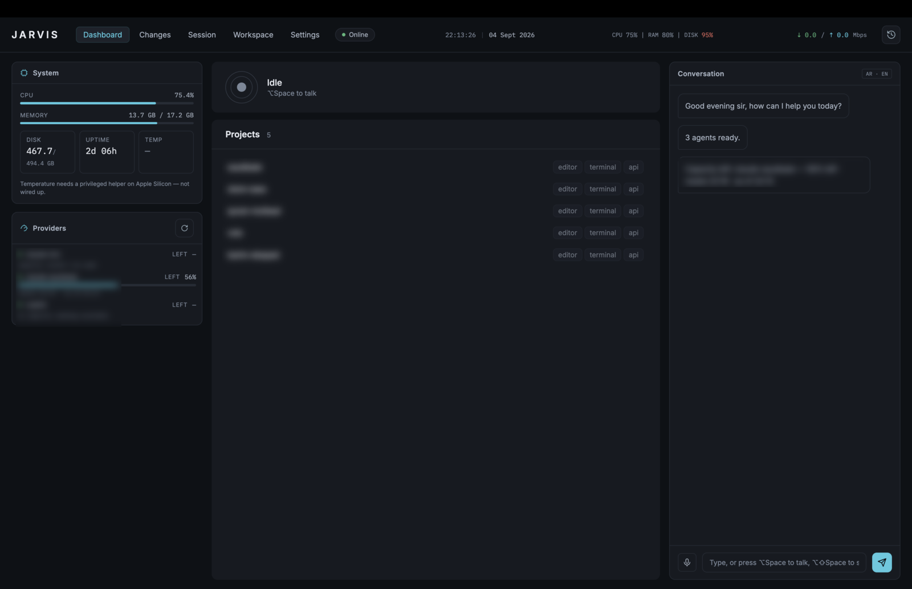

# Jarvis

A desktop workspace for running coding agents by voice, and for doing the work
around them without leaving it: the project's files, its databases, a shell in
it, and its APIs.

Jarvis is a single Electron app over a pnpm workspace. It speaks Arabic and
English, and it is built for one person on one machine — there is no server,
no account, and nothing leaves the laptop that was not already going to. It
opens full screen.

Everything in the Workspace belongs to a project, except the **Personal**
browser, which belongs to none: somewhere to keep tabs that are not work,
with its own logins and its own bookmarks.

```
⌥Space            talk to the brain, or to the session you are looking at
Dashboard         what every agent is doing, and what the machine is doing
Changes           the working tree, staged and committed from here
Session           one agent's real terminal
Workspace         a browser, an editor, a database client, a shell, an API client, a cluster browser
Settings          everything jarvis.yaml holds, edited in place
```

<p align="center">
  
</p>

<p align="center">
  <sub>The Dashboard. Project names, provider accounts and capacity figures are blurred — everything else is the running app.</sub>
</p>

## What it does

**Runs the agents.** Each agent is a real process under a real pty, not an API
call — its terminal is the terminal, and the Session route shows exactly what
it drew. The Dashboard reports what every one of them is doing at once, beside
what the machine has left to give them, and how much capacity each provider
account has before it resets.

**Listens.** ⌥Space talks to the brain, which resolves what you said against
the projects and sessions that actually exist, so "افتح سعودي سيل" reaches a
project keyed `acme`. Speak to a session instead and the words go to that
agent's stdin.

**Keeps the work in one window.** The Workspace opens a project's files in an
editor, its tables in a database client, its endpoints in an API client, its
cluster in a browser, and a shell rooted where the project is — each as an
ordinary tab beside the others.

**The Terminal tab is Warp-shaped.** Each command and its output become an
addressable block you can collapse, copy, re-run or filter to the ones that
failed; a real editor sits at the prompt with history-ranked completion; the
pane splits; ⌘P reaches every action. A file sidebar follows the shell as it
`cd`s, and a row of chips above the input names the directory, the branch and
what is uncommitted. Re-run, workflows, history and the AI's suggestion all
*fill* the line — you press Enter yourself, always.

## Getting started

New machine? **[SETUP.md](SETUP.md)** walks the whole thing, start to finish.

```bash
pnpm install
pnpm --filter @jarvis/desktop start      # builds, then opens the app
```

Configuration lives at `~/.config/jarvis/jarvis.yaml`. Jarvis reads it at
startup; the Settings route writes it back. See **[the configuration
guide](docs/guide/configuration.md)** for what every key does, and
**[installation](docs/guide/installation.md)** for the handful of external
tools each Workspace tab needs.

## Documentation

**Using it**

- [Setup](SETUP.md) — a new machine, start to finish
- [Installation](docs/guide/installation.md) — prerequisites, first run, what each optional tool unlocks
- [Configuration](docs/guide/configuration.md) — every key of `jarvis.yaml`, with worked examples
- [The routes](docs/guide/routes.md) — Dashboard, Changes, Session, Workspace, Settings
- [Workspace tabs](docs/guide/workspace-tabs.md) — browser, Editor, Database, Terminal, API
- [The API client](docs/guide/api-client.md) — collections, environments, scripts, auth, cookies
- [Troubleshooting](docs/guide/troubleshooting.md) — what breaks, and what it means

**Working on it**

- [Architecture](docs/develop/architecture.md) — the three packages and what may import what
- [Conventions](docs/develop/conventions.md) — the rules this codebase enforces, and why each exists
- [Testing](docs/develop/testing.md) — what is tested where, and what tests cannot see
- [Adding a Workspace tab](docs/develop/adding-a-tab.md) — the pattern, end to end

**History** — [`docs/specs/`](docs/superpowers/specs) records why each feature is
shaped the way it is; [`docs/plans/`](docs/superpowers/plans) records how it was
built. They are not maintained as documentation, and where they disagree with
the guides above, the guides are current.

## Commands

| | |
|---|---|
| `pnpm test` | the whole suite |
| `pnpm typecheck` | `tsc -b` across the workspace |
| `pnpm --filter @jarvis/desktop build` | compile and copy vendored assets |
| `pnpm --filter @jarvis/desktop start` | build, then run |

The build step matters: the renderer's vendored libraries and the app icon are
copied into `dist/` by a script, not by `tsc`. Running `tsc` alone leaves them
stale.

## How it is built

Three packages, and the rule that keeps them apart: `core` holds the logic and
imports nothing from the others; `platform` owns everything that touches the
machine — processes, ptys, git, the filesystem; `desktop` is Electron's main
process and the renderer, and it is the only one allowed to know about either.
[Architecture](docs/develop/architecture.md) states what may import what and
why the boundary is worth having.

Almost 2,900 tests run in a few seconds because the parts that hold the logic
take their I/O injected: a splitter that cuts a pty stream into blocks is a
pure function over chunks, a completion engine is a pure function over history,
and the code that spawns and reads is small and separate. What tests cannot
see — how it looks, whether a terminal reflows, whether a real shell behaves —
is written down in [testing](docs/develop/testing.md) rather than assumed.

Features arrive by the same route each time: a design in
[`docs/superpowers/specs/`](docs/superpowers/specs) argues for the shape,
a plan in [`docs/superpowers/plans/`](docs/superpowers/plans) breaks it into
reviewable pieces, and each piece is written test-first and read by a fresh
reviewer before the next begins. The specs record the decisions that were
close, including the ones that were wrong first.

## Licence

Private. Third-party components keep their own licences — see
[architecture](docs/develop/architecture.md#third-party-components).
