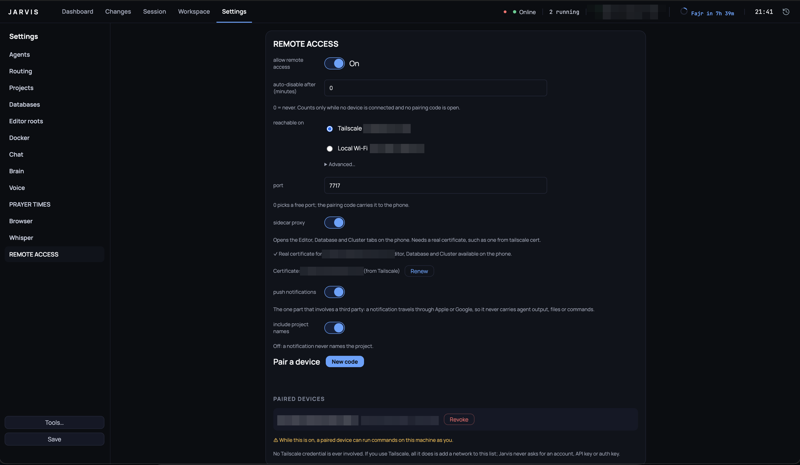
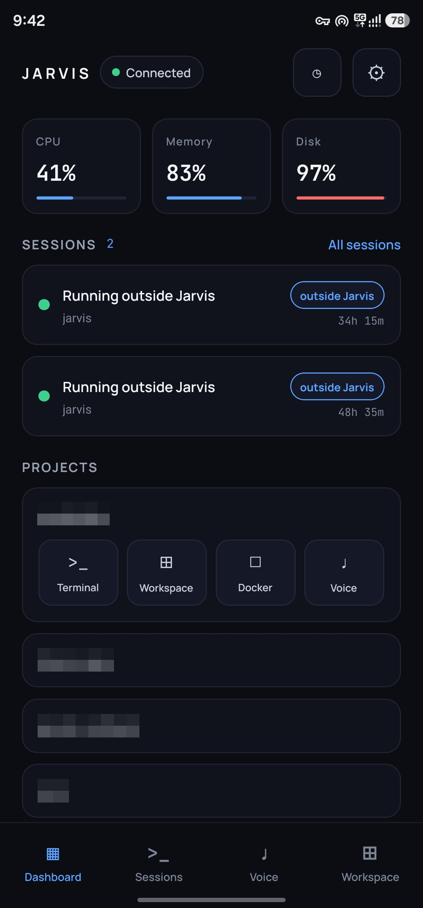
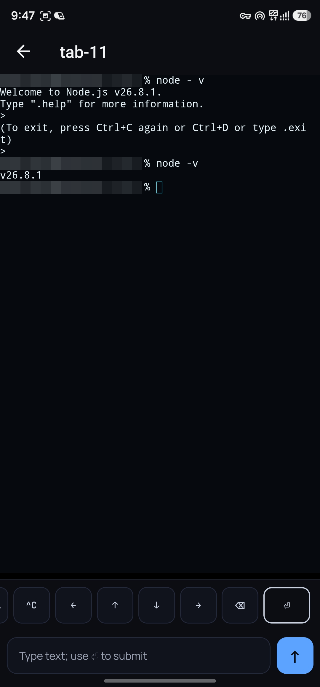
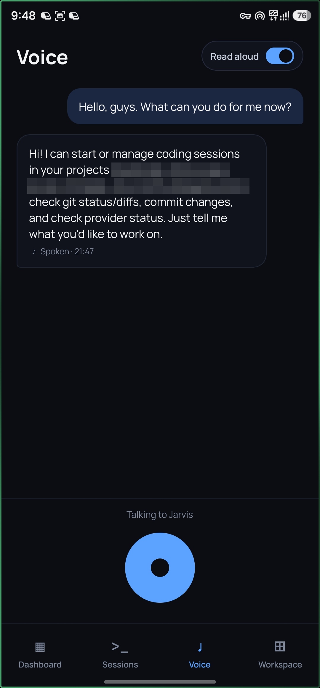
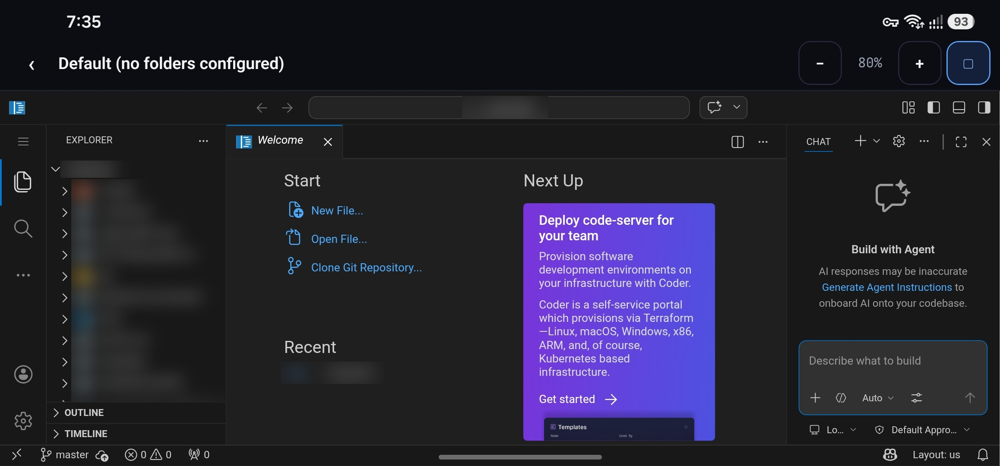
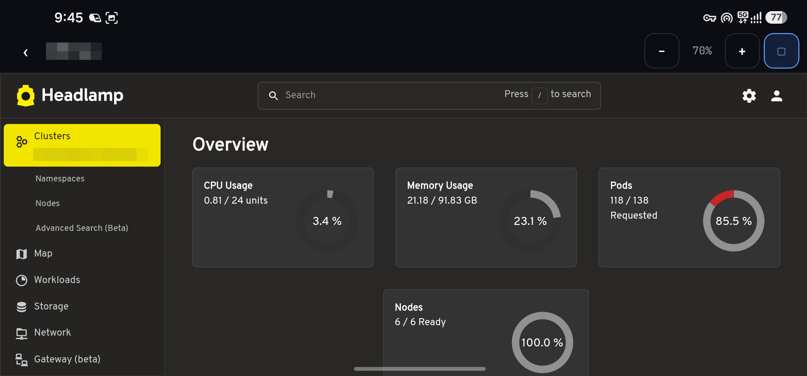

# Remote access

The mobile remote bridge lets a paired phone reach this laptop over a local
connection — see the root README's "What it exposes" for what the bridge is,
when it listens, and what a paired phone can do on this machine. This page
covers the phone side: pairing, what the phone app can see, what happens when
a pairing ends, and the three ways a pairing can be reached.

## Three paths to a pairing

Which trust mode a pairing uses — and whether the Editor, Database and
Cluster tabs can ever work for it — depends on how the laptop's certificate
is set up at the moment you pair, not on any separate switch:

1. **Tailscale with a real certificate.** `remote.tls.certPath`/`keyPath`
   (see [configuration](configuration.md)) point at a certificate from
   `tailscale cert` (below) that carries a DNS name. The pairing link then
   carries that name, and the phone dials it for `/pair`, `/rpc` and the
   WebView with the OS's own trust store — no pin. The phone's sidecars
   screen shows its three rows enabled; whether tapping one actually opens
   the tab further depends on `remote.sidecarProxy` being on too — with a
   named certificate served and the proxy on, Editor, Database and Cluster
   open in an in-app WebView through the sidecar proxy. This is the only
   combination where those three tabs work.
2. **Bare LAN, pinned.** No configured certificate, or one without a DNS
   name. The laptop serves its self-signed certificate; the phone pins its
   exact fingerprint, the same as every pairing before this milestone. The
   confirm step says "pins …" rather than naming a trust store, and the
   phone's record carries no name. The Dashboard and its projects, metrics
   and sessions work as before; the sidecars screen shows its three rows
   disabled with a hint to connect over Tailscale with a real certificate,
   and the phone never asks the laptop for one.
3. **Nothing.** `remote.enabled` is `false`, or nothing is paired and no
   pairing window is open — no socket listens at all (see "What it exposes"
   in the root README).

A pairing's trust mode is fixed at pairing time and does not change
afterwards; a laptop that moves from path 2 to path 1 (or the reverse)
needs the phone to pair again, because the certificate the phone would need
to trust changed. `remote.sidecarProxy` itself can be flipped at any time
without a re-pair — on a path-1 (named-certificate) pairing this only
changes what tapping a row on the phone answers, not whether the rows show
enabled. The flip does restart the bridge, though: the phone's live `/rpc`
connection drops and reconnects, and every open sidecar tab's handle is
cleared, so open sidecar tabs need reopening.

  

## The `tailscale cert` walkthrough

To get path 1 above:

1. On the laptop, with Tailscale installed, MagicDNS on, and HTTPS
   certificates enabled for the tailnet in the Tailscale admin console, run
   `tailscale cert <machine>.<tailnet>.ts.net` (your own machine and tailnet
   name — `tailscale status` shows both). This writes `<name>.crt` and
   `<name>.key` in the current directory.
2. Set `remote.tls.certPath` and `remote.tls.keyPath` in `jarvis.yaml` to
   those two files (`~/` is expanded), and turn `remote.sidecarProxy` on.
3. Restart the bridge for the new certificate to take effect: toggle it Off
   then On in Settings, or restart Jarvis.
4. Re-pair the phone. The pairing link now carries `&name=<the
   certificate's DNS name>`, and the confirm step shows that name and "trusts
   the certificate through the phone's own trust store" rather than a pin.
   **The phone needs Tailscale's MagicDNS on** to resolve that name — the
   same requirement as the laptop.

**Renewal.** A `tailscale cert` certificate is short-lived and needs
renewing (Tailscale documents its own interval). Run `tailscale cert` again
for the same name and toggle the bridge (Off/On, or restart Jarvis) — **no
re-pair needed**: the phone dials the same name every time in this mode, so
a renewed certificate under that name is trusted the same way the first one
was.

If a **pinned** (path 2) pairing's laptop is later moved onto path 1 (or its
self-signed certificate is regenerated), the phone's saved fingerprint no
longer matches what the laptop serves — it shows the pin-mismatch banner
described below, with a "Pair again" button: tapping it asks you to confirm
("This removes the pairing from this phone. You'll need to scan a new QR
code to pair again. The computer keeps this device listed until you also
remove it in its Settings."), then unpairs on the phone and lands on the
pairing screen, ready to scan the new link.

## Sidecars over Tailscale, from Settings

Settings → Remote access can get the same certificate the walkthrough above
runs by hand:

1. On the laptop, with Tailscale installed and connected, enable **HTTPS
   certificates** for the tailnet in the Tailscale admin console (DNS →
   HTTPS Certificates) — the laptop's own `tailscale cert` fails with "your
   Tailscale account does not support getting TLS certs" until this is on,
   and Settings shows exactly that, with a link straight to the admin
   console's DNS page.
2. In Settings → Remote access, under the sidecar proxy switch, click **Get
   certificate from Tailscale**. This finds Tailscale, reads the laptop's
   own MagicDNS name (`tailscale status`), and runs `tailscale cert` for
   it — the same command and the same `~/.config/jarvis/tls/` destination
   the manual walkthrough uses. On success the certificate row names it and
   the sidecar proxy switch turns on by itself.
3. Restart the bridge for the new certificate to take effect: toggle it Off
   then On, or restart Jarvis — same as the manual walkthrough.

**Re-pairing.** Exactly the rule above: a laptop moving from no certificate
(or a self-signed one) to this named one is moving from path 2 to path 1, so
every phone already paired needs to pair again — the pairing link's carried
name changed. Clicking **Get certificate** again once a certificate is
already configured relabels the button **Renew** and re-runs the same
command for the same name; Tailscale renews it in place, so **no re-pair is
needed** for a renewal — the phone was already trusting the certificate's
name, not its fingerprint.

If Tailscale is not installed, or not connected, the button's own error
names which ("Install Tailscale on this Mac." / "Connect Tailscale first.")
rather than the generic HTTPS-certificates message above.

## What the sidecar proxy exposes

On path 1, opening the Editor, Database or Cluster tab from the phone gets a
one-time URL under `/s/<a random handle>/…` on the same host and port as
everything else the bridge serves — never the sidecar's own port. That first
request redeems a single-use key and sets a cookie (`HttpOnly; Secure;
SameSite=Strict`, scoped to that one handle's path) that authenticates every
request after it; any plain HTTP request that isn't a validly cookie- or
key-authenticated `/s/<handle>/…` request gets its connection closed with
no response at all (the `/rpc` and `/pair` upgrades are unaffected — they
are answered as before), the same "no banner to an unauthenticated peer"
rule the rest of the bridge already follows. A handle lives at most 24
hours and at most 8 at a time per device (see the root README) — but that
bound is on *new* requests only: neither the 24-hour expiry nor an eviction
(publishing a 9th handle for the same device retires its oldest) cuts a
connection already open on the affected handle; only revoking the device or
restarting the bridge does that.

## The phone app

A companion phone app (`apps/mobile` in the repository) pairs with
**Settings → Remote access** on the laptop.

**Installing it.** Android: download `jarvis-mobile-<version>.apk` from the
[releases page](https://github.com/mmAbdelhay/jarvis/releases), open it on
the phone and allow the install (it is not on a store). iOS has no
prebuilt binary — build it from source with EAS; `apps/mobile/README.md`
has the walkthrough, which is also the path for a development build on
either platform.

  
  
  

  
  

**Pairing.** With the bridge on and a pairing window open, the laptop shows a
QR code beside the link text, and the certificate's fingerprint tail (its
last 4 hex characters) printed beside both. On the phone, scanning that QR,
pasting the link text, or opening the `jarvis://pair…` deep link all land on
the same confirmation step first: the host, the port, and that same
fingerprint tail, so you can check the two match before anything connects.
Approving there opens the pinned connection and sends the pairing exchange;
approving the laptop's own confirmation dialog (which names the requesting
device) finishes it. A phone that already has a pairing refuses a new link
outright — it has to be unpaired in Settings first, so a link cannot
silently replace an existing pairing.

**Idle auto-disable.** Idle counts only while no paired phone is connected and no pairing code is open; an attempt to connect that fails does not reset it. Set `remote.idleDisableMinutes` in Settings (or in `jarvis.yaml`) to the whole number of minutes, or `0` to leave it off. While the timer is armed, Settings shows "Will turn off automatically at `<time>`"; after it fires, the bridge shows "Turned off automatically at `<time>` after N min idle" and the Dashboard listening indicator disappears. The bridge closes its listener first, then main writes `remote.enabled: false` to `jarvis.yaml` through the Settings write queue, so the file agrees with the already-closed listener. A failed write is logged to the desktop console and the file still reads `enabled: true` until the next save; the bridge stays off either way. Turning the switch on and saving applies `enabled: true` again.

**Audit log.** `~/.config/jarvis/remote/audit.log` is mode 0600 and rotates once to `audit.log.1` when the current file would exceed 5 MiB. It records pairings, connections, authentication failures, revocations, mutating remote calls, the first input key for each session or pane per connection, refused probes up to the per-connection cap, queued push kinds and idle shut-offs. Read a line as an ISO timestamp, an event name, and sorted `key=value` fields; the fields identify a device and channel or a bounded outcome, never the payload. The audit log never contains a token, a pairing secret, what you typed, what an agent printed or a file's contents — only which device did what kind of thing, and when.

**Dashboard and Sessions.** Once paired, the Dashboard shows the laptop's projects, live system metrics (CPU, memory, disk, network, uptime and temperature when available), and sessions. The Sessions table includes finished sessions too.

Pulling to refresh on the Sessions screen calls `sessions:refresh` (a `read` channel, audited like every other remote call): the laptop re-imports any new transcripts and re-scans its own process table for agent processes running outside Jarvis — one started by typing `claude` or `codex` into an ordinary terminal — then re-lists. Such a row carries an "outside Jarvis" chip and is read-only: no attach, no input, nothing to resume.

A project's Terminal tile on the Dashboard, and the Workspace screen's own "New terminal" button, open a new terminal tab on the laptop in that project and land the phone on it — the same `terminal:open` channel the desktop's own tab uses, remote-legal for exactly the projects the laptop has configured. It is a `mutate` channel, so every call is audited, the same weight as a Docker start or an API save.

Tapping a session opens its terminal: the same output the laptop shows, rendered by the same terminal engine, with a key bar for Esc, Tab, Shift-Tab, Ctrl, arrows and Enter.

Typed text is sent exactly as written and never presses Enter for you; the ⏎ key is the only thing that does.

Nothing you type while the phone is disconnected is sent later — reconnect and type it again.

The phone and the laptop share one terminal size, so whichever one you are looking at sets it; the laptop takes its size back when you return to its Session view.

Finished sessions open read-only. A trimmed-output badge and a dim marker identify output that was dropped. Links in terminal output do not open the browser, and any external session link (other than a pairing link, which opens the pairing screen, or a notification tap, which opens the session) returns to the Dashboard.

**Voice.** Tap the mic on the phone, speak, and tap again: the recording is sent to the laptop, transcribed by the same whisper model the laptop uses, and answered by Jarvis — and the reply is spoken by the phone, not the laptop. The laptop stays silent for anything you say or type from the phone; the conversation still appears in the laptop's transcript. The mic on a session's screen types what you said into that agent and presses Enter, exactly as speaking to an open session does on the laptop. A finished session's mic is disabled. A recording that could not be sent is kept on the phone until you tap Retry or Discard; nothing is sent later on its own. Replies are spoken with the phone's own voices; if the phone has no Arabic voice installed, the reply is shown instead. A recording is at most 120 seconds and 4 MiB, and the laptop deletes it as soon as it has been transcribed.

**Editor, Database and Cluster, in M11.** Tapping a project on the Dashboard
opens its sidecars screen: an Editor row per project root, one Database row,
and one Cluster row per configured cluster. On path 1 above these open
code-server, DbGate or Headlamp in an in-app WebView through the sidecar
proxy — typing in a file and a code-server terminal both work, since the
proxy pipes WebSocket upgrades through raw as well as ordinary requests. The
WebView never navigates off the sidecar's own origin and never opens the
system browser; DbGate opens already logged in, because its credential is
injected by the proxy rather than typed anywhere. On path 2, the three rows
are disabled with a hint to connect over Tailscale with a real certificate,
and tapping them makes no request. A Cluster tab needs the cluster already
connected on the laptop — opening it from the phone never starts a login
flow or an MFA prompt there.

**Workspace, Changes, Docker, history and the API client, in M9.** The
Workspace tab shows the laptop's open tabs grouped by project, read-only —
tapping into an open Terminal tab attaches to one of its existing panes
(never creates, splits or closes one) with the same terminal engine and key
bar Sessions uses; a web or chat tab's row hands off to the system browser,
behind the same URL safety check every external link on the phone goes
through (an unresolvable or unsafe URL shows a notice instead of opening
anything); an Editor, Database or Cluster tab's row links to the sidecar
screens described above; a Docker or API tab's row opens the phone's own
Docker or API screen, described next. The Changes tab shows a session's git
status — staged and unstaged files, a diff per file — and lets you stage,
unstage and commit from the phone; it refreshes on its own whenever the
laptop's own file counts change, so it never shows a stale "clean" tree
after a commit made elsewhere. The Docker tab lists a project's configured
containers and their state, with start, stop, restart and compose up/down
actions; it can live-follow one container's logs at a time (a device may
hold at most four followers at once) — a live log is not durable history,
so reconnecting after a drop inserts a plain marker for whatever was missed
rather than pretending nothing was; the shell into a container stays
laptop-only. The History tab lists every session, finished or not, and its
transcript, read-only. The API client is reachable from the phone with the
same collections, requests and environments the laptop sees; sending and
saving work the same way, except a remote send never runs a request's
pre-request/post-response scripts or an OAuth2 grant, and a multipart file
field is never read from a path on the laptop — a file picked on the phone
is uploaded first and the request refers to it by the id that upload
returns. A remote save drops the same things a remote send skips. Importing
a Postman collection from the phone goes through the same upload step, and
that import alone is bounded — a cap on how many requests it may produce, a
decoded size/depth/node-count check, and a scan for control characters in
the names and values the conversion produces — bounds a Postman import
triggered from the laptop's own file picker does not carry at all.

**Notifications, in M10.** Notifications are off until you turn them on in
two places: the laptop's Settings → Remote access → push notifications, and
the phone's Settings → Notifications. A notification says only what kind of
thing happened — an agent finished, failed or is waiting for you; a long
command ended; Jarvis answered — and, if you set
`remote.push.includeProjectNames: true`, which project. It never carries
terminal output, a command, a file path, an agent's words or a transcript,
because it travels through Apple's or Google's notification service via
Expo's push API. Nothing is sent while the Jarvis window is focused on the
laptop, or while the phone is already showing the session or reply in
question. Tapping a notification opens the app; it goes to the session only
if that session is still in the laptop's list. The laptop holds no Apple or
Google credential of its own — Expo's push service is the only third party
in this path, and the credentials that authorize *it* to reach Apple and
Google are configured once, on EAS, not in this repository (see
`apps/mobile/README.md`'s "Push credentials").

A phone in the background stops watching at once, so a notification is not held back until the connection times out.

**Certificate pinning.** On a pinned (path 2) pairing, the phone trusts
exactly one certificate: the one whose fingerprint was in the QR you
scanned. If the laptop's certificate changes, the phone refuses to connect
and shows the mismatch banner described below. A system-trust (path 1)
pairing pins nothing — it trusts the certificate's name through the phone's
own OS trust store, which is what lets a `tailscale cert` renewal go
through with no re-pair.

A certificate that *stops matching after pairing* — the laptop's key pair
was regenerated, or (for a phone paired before M11 against a `tailscale
cert` certificate with no `name` in its link) a renewal rotated it — seen
the next time the phone tries to connect, is handled differently from a
certificate that never matched: the phone does **not** unpair itself just
because one connection attempt hit a mismatch. Doing that would let anyone
on the same network force a re-pair by presenting a different certificate.
Instead it keeps retrying with backoff and shows a banner explaining that
this device's saved certificate doesn't match, with a "Pair again" button.

**Revocation.** Revoking a device from the laptop's Settings closes its
connection immediately; the phone forgets its token and returns to the
pairing screen. Revocation is total: it also destroys that device's live
sidecar connections, not just its handles — an Editor or Database tab open
on the phone at that moment stops immediately, mid-stream, because its
underlying socket is cut, not merely on its next navigation. If clearing the
stored pairing on the phone itself fails
(a keychain error), the pairing screen shows a distinct "couldn't remove the
old pairing" state with a Retry button, rather than looping back to a
Dashboard that can no longer authenticate.

Unpairing *from the phone* (Settings → Unpair this phone) only removes the
phone's own keychain entries; it does not revoke anything on the laptop. The
laptop keeps the device listed, with a valid token, until it is removed
there too — the phone's confirmation dialog says so.

**Language and RTL.** The phone's language is its own setting (defaulting to
the device locale) and is not part of the pairing record. Changing it in
Settings asks you to restart the app — real right-to-left layout is applied
process-wide at startup, so it cannot take effect until the app restarts.
