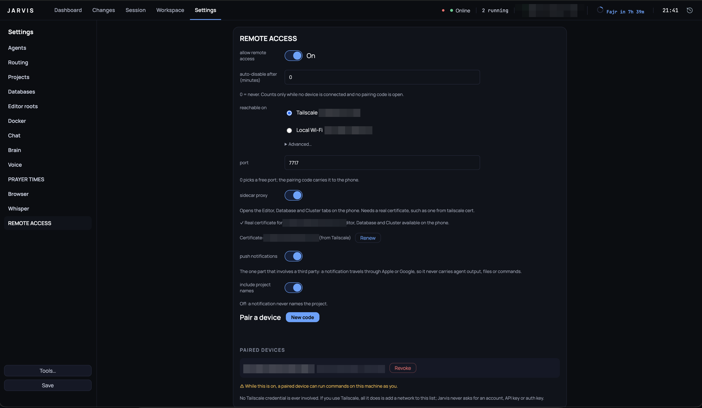
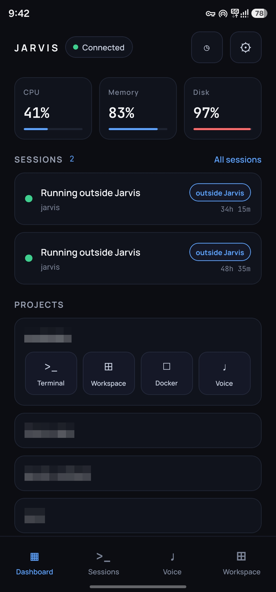
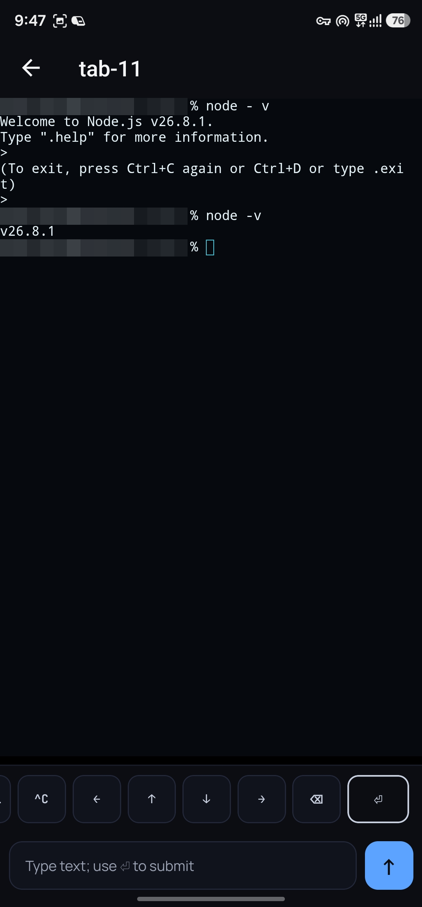
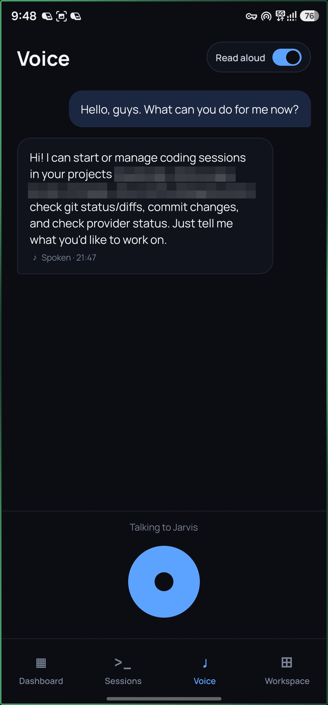
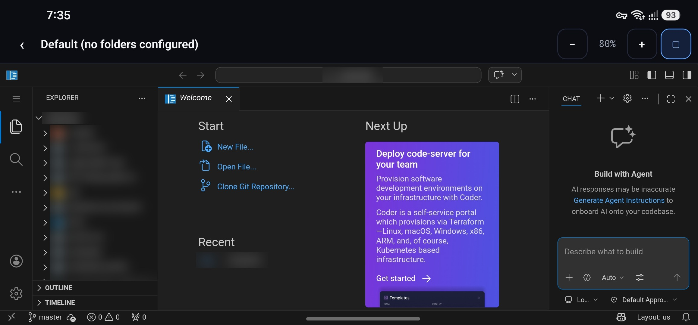
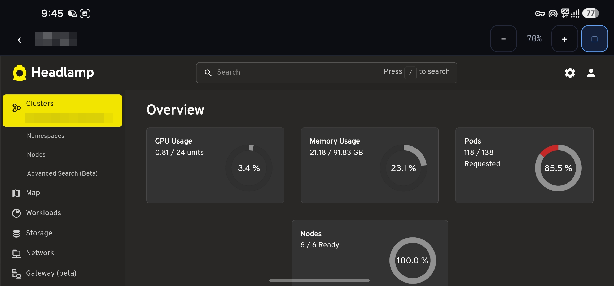

# Remote access

The mobile remote bridge lets a paired phone reach this laptop over a local
connection — see the root README's "What it exposes" for what the bridge is,
when it listens, and what a paired phone can do on this machine. This page
covers the phone side: pairing, the owner login every paired device signs in
with, what the phone app can see, what happens when a pairing ends, and the
three ways a pairing can be reached. The same app also runs in a browser on
another computer or phone; see [The browser client](#the-browser-client) at
the end.

## Three paths to a pairing

Which trust mode a pairing uses — and whether the Editor, Database and
Cluster tabs can ever work for it — depends on how the laptop's certificate
is set up at the moment you pair, not on any separate switch:

1. **Tailscale with a real certificate.** `remote.tls.certPath`/`keyPath`
   (see [configuration](configuration.md)) point at a certificate from
   `tailscale cert` (below) that carries a DNS name. The pairing link then
   carries that name, and the phone dials it for `/pair`, `/rpc` and the
   WebView with the OS's own trust store — no pin. The phone's sidecars
   screen shows its three rows enabled; whether tapping one actually opens
   the tab further depends on `remote.sidecarProxy` being on too — with a
   named certificate served and the proxy on, Editor, Database and Cluster
   open in an in-app WebView through the sidecar proxy. This is the only
   combination where those three tabs work.
2. **Bare LAN, pinned.** No configured certificate, or one without a DNS
   name. The laptop serves its self-signed certificate; the phone pins its
   exact fingerprint, the same as every pairing before this milestone. The
   confirm step says "pins …" rather than naming a trust store, and the
   phone's record carries no name. The Dashboard and its projects, metrics
   and sessions work as before; the sidecars screen shows its three rows
   disabled with a hint to connect over Tailscale with a real certificate,
   and the phone never asks the laptop for one.
3. **Nothing.** `remote.enabled` is `false`, or nothing is paired and no
   pairing window is open — no socket listens at all (see "What it exposes"
   in the root README).

A pairing's trust mode is fixed at pairing time and does not change
afterwards; a laptop that moves from path 2 to path 1 (or the reverse)
needs the phone to pair again, because the certificate the phone would need
to trust changed. `remote.sidecarProxy` itself can be flipped at any time
without a re-pair — on a path-1 (named-certificate) pairing this only
changes what tapping a row on the phone answers, not whether the rows show
enabled. The flip does restart the bridge, though: the phone's live `/rpc`
connection drops and reconnects, and every open sidecar tab's handle is
cleared, so open sidecar tabs need reopening.

<p align="center">
  
</p>

## The `tailscale cert` walkthrough

To get path 1 above:

1. On the laptop, with Tailscale installed, MagicDNS on, and HTTPS
   certificates enabled for the tailnet in the Tailscale admin console, run
   `tailscale cert <machine>.<tailnet>.ts.net` (your own machine and tailnet
   name — `tailscale status` shows both). This writes `<name>.crt` and
   `<name>.key` in the current directory.
2. Set `remote.tls.certPath` and `remote.tls.keyPath` in `jarvis.yaml` to
   those two files (`~/` is expanded), and turn `remote.sidecarProxy` on.
3. Restart the bridge for the new certificate to take effect: toggle it Off
   then On in Settings, or restart Jarvis.
4. Re-pair the phone. The pairing link now carries `&name=<the
   certificate's DNS name>`, and the confirm step shows that name and "trusts
   the certificate through the phone's own trust store" rather than a pin.
   **The phone needs Tailscale's MagicDNS on** to resolve that name — the
   same requirement as the laptop.

**Renewal.** A `tailscale cert` certificate is short-lived and needs
renewing (Tailscale documents its own interval). Run `tailscale cert` again
for the same name and toggle the bridge (Off/On, or restart Jarvis) — **no
re-pair needed**: the phone dials the same name every time in this mode, so
a renewed certificate under that name is trusted the same way the first one
was.

If a **pinned** (path 2) pairing's laptop is later moved onto path 1 (or its
self-signed certificate is regenerated), the phone's saved fingerprint no
longer matches what the laptop serves — it shows the pin-mismatch banner
described below, with a "Pair again" button: tapping it asks you to confirm
("This removes the pairing from this phone. You'll need to scan a new QR
code to pair again. The computer keeps this device listed until you also
remove it in its Settings."), then unpairs on the phone and lands on the
pairing screen, ready to scan the new link.

## Sidecars over Tailscale, from Settings

Settings → Remote access can get the same certificate the walkthrough above
runs by hand:

1. On the laptop, with Tailscale installed and connected, enable **HTTPS
   certificates** for the tailnet in the Tailscale admin console (DNS →
   HTTPS Certificates) — the laptop's own `tailscale cert` fails with "your
   Tailscale account does not support getting TLS certs" until this is on,
   and Settings shows exactly that, with a link straight to the admin
   console's DNS page.
2. In Settings → Remote access, under the sidecar proxy switch, click **Get
   certificate from Tailscale**. This finds Tailscale, reads the laptop's
   own MagicDNS name (`tailscale status`), and runs `tailscale cert` for
   it — the same command and the same `~/.config/jarvis/tls/` destination
   the manual walkthrough uses. On success the certificate row names it and
   the sidecar proxy switch turns on by itself.
3. Restart the bridge for the new certificate to take effect: toggle it Off
   then On, or restart Jarvis — same as the manual walkthrough.

**Re-pairing.** Exactly the rule above: a laptop moving from no certificate
(or a self-signed one) to this named one is moving from path 2 to path 1, so
every phone already paired needs to pair again — the pairing link's carried
name changed. Clicking **Get certificate** again once a certificate is
already configured relabels the button **Renew** and re-runs the same
command for the same name; Tailscale renews it in place, so **no re-pair is
needed** for a renewal — the phone was already trusting the certificate's
name, not its fingerprint.

If Tailscale is not installed, or not connected, the button's own error
names which ("Install Tailscale on this Mac." / "Connect Tailscale first.")
rather than the generic HTTPS-certificates message above.

## What the sidecar proxy exposes

On path 1, opening the Editor, Database or Cluster tab from the phone gets a
one-time URL under `/s/<a random handle>/…` on the same host and port as
everything else the bridge serves — never the sidecar's own port. That first
request redeems a single-use key and sets a cookie (`HttpOnly; Secure;
SameSite=Strict`, scoped to that one handle's path) that authenticates every
request after it; any plain HTTP request that isn't a validly cookie- or
key-authenticated `/s/<handle>/…` request gets its connection closed with
no response at all (the `/rpc` and `/pair` upgrades are unaffected — they
are answered as before), the same "no banner to an unauthenticated peer"
rule the rest of the bridge already follows. A handle lives at most 24
hours and at most 8 at a time per device (see the root README) — but that
bound is on *new* requests only: neither the 24-hour expiry nor an eviction
(publishing a 9th handle for the same device retires its oldest) cuts a
connection already open on the affected handle; only revoking the device or
restarting the bridge does that.

## Owner login

Reaching this machine takes two things, checked separately:

1. **Pairing** says *which device* is talking. The laptop issues a device
   token when you approve the pairing dialog, and every connection starts
   by presenting it.
2. **Owner login** says *that you are the one holding it*. A paired device
   that connects is **locked** until it signs in with the owner password
   (or, in a browser, a passkey). A lost or copied phone
   with a valid pairing still cannot see or run anything.

**Setting the password.** The owner password is set and changed only on the
laptop, in **Settings → Remote access → Owner account** — never from a phone
or a browser. It must be at least 12 characters. Changing it asks for the
current one first. It is stored as a scrypt hash (N=2^17, r=8, p=1, with a
random salt) in `~/.config/jarvis/remote/owner.json` (see
[configuration](configuration.md#owner-login-files)); the password itself
is never written anywhere or logged.

**The bridge will not start without one.** With no owner password, the bridge
stays off even when `remote.enabled` is `true`, and Settings says "Remote
access stays off until you set an owner password below." This covers
upgrading, too: if the bridge was on before this version, it stays off after
the upgrade — your paired phones cannot connect — until you set a password.
Setting the first password starts the bridge straight away. `jarvis.yaml`
needs no change, and existing pairings keep working.

**What a locked connection can do.** A locked connection stays open, but
answers only the sign-in channels: status, password login, passkey login,
token refresh, resume and logout. Everything else — every screen, every
subscription, every upload, and opening a sidecar tab — is refused with
`locked` until sign-in succeeds. Adding a passkey is refused too; that
requires a signed-in connection.

**Tokens.** A successful sign-in returns two tokens:

- an **access token** that lasts 15 minutes. The phone keeps it in memory
  only, never on disk.
- a **refresh token** that gets a new access token without the password. It
  expires after 7 days unused, and 30 days after the sign-in that started it,
  whatever happens. Each refresh replaces it with a new one and retires the
  old one. If the reply carrying the new one is lost (the network drops
  mid-refresh), the phone retries with the token it still holds. Within 10
  minutes, and only while the new token has never been used, the laptop
  issues a fresh pair instead and cancels the unused one (audited
  `refresh-retry`). Later than that, the sign-in ends quietly and the phone
  asks for the password (`refresh-stale`). Any other retired refresh token
  presented again is assumed to be copied: the laptop ends that sign-in and
  every token descended from it, and shows a desktop notification: "An old
  sign-in session was reused".

The laptop keeps only SHA-256 hashes of refresh tokens, in `sessions.json`.
Access tokens are held in memory only, so restarting Jarvis or the bridge
means every device refreshes or signs in again.

**Guessing limits.** Wrong passwords are limited per device and across the
whole bridge:

- **Per device.** After 5 wrong passwords, that device cannot try again for
  1 minute. Each further wrong password doubles the wait, up to 1 hour. A
  successful sign-in resets the count. The laptop shows a desktop
  notification naming the device, at most once per device every 15 minutes.
- **Across all devices.** 20 wrong passwords within one hour pause every
  sign-in, from every device, for 15 minutes. The laptop shows a desktop
  notification: "Remote sign-in paused".

These counts are kept in memory, so restarting Jarvis resets them. While a
lockout lasts, even the right password is refused, and the reply does not
say whether it was right. The audit log records each sign-in
(`login-succeeded`, `login-failed`), each lockout as it starts (`locked-out`,
with `scope=device` or `scope=global`), and attempts refused during a
lockout. Those refusals are collected into one `login-refused` line with a
`count` per device per minute, so a device retrying in a loop cannot flood
the log. Attempts refused because too many password checks were already
waiting are logged the same way, with `scope=capacity`.

**What signs devices out.** Each of these ends signed-in sessions:

| Trigger | Ends |
|---|---|
| Changing the owner password | every session, on every device |
| Deleting a passkey in Settings | every session, on every device |
| **Sign out everywhere** in Settings | every session, on every device |
| Revoking a device in Settings | that device's sessions, and its pairing |
| Logging out on the device | that one sign-in |

Signed-in connections are locked on the spot, not at their next request, and
the device is told why. Sidecar tabs (Editor, Database, Cluster) follow the
sign-in. When a device's connection locks, its sidecar handles are revoked
and its live sidecar connections are cut mid-stream, the same way revocation
cuts them. A device that is not signed in cannot open a new one.

**On the phone.** After pairing, the phone shows an unlock screen. Enter the
owner password once. If the phone has a screen lock, the app then keeps the
refresh token in the phone's secure storage: the iOS keychain (only while a
passcode is set, on this device only) or Android storage encrypted with an
Android Keystore key. It is never included in backups. Before reading it,
the app asks for Face ID, fingerprint or the phone's passcode, so later
unlocks go through that prompt. The app makes that check, not the stored
key: the key is not bound to biometrics, so something that can run code as
the app on an unlocked phone could read the token without a prompt. The
password field is always there as a fallback. A phone with no biometrics or
passcode set up keeps nothing, and asks for the password every time. The app
also locks itself after 15 minutes with no touches. You can choose 5, 15, 30
or 60 minutes in the app's **Settings → Security**, which also has **Log
out**. Logging out ends this phone's sign-in on the laptop and deletes the
stored token. The pairing stays. A phone coming back from the background
after its idle time is already locked.

**Passkeys** are for the browser client (see [The browser
client](#the-browser-client) below). A passkey is added from a browser that
is already signed in, and adding one asks for the owner password again. The
laptop's **Settings → Remote access → Owner account** lists passkeys and
deletes them. The phone app always uses the password and the phone's own
unlock. A passkey belongs to the certificate's DNS name and is checked
against the browser listener's address, so while browser access is off
(`remote.web.enabled` is `false`, or its listener is not running) the
passkey channels answer `unsupported` and only the password works.

**Protocol version 2.** Owner login changes the wire protocol, so the phone
app and the laptop must both be updated. An older app talking to an updated
laptop, or an updated app talking to an older laptop, is refused at connect.
The updated app says "Update the Jarvis app. If it's already up to date,
update Jarvis on your computer." Existing pairings carry over once both sides
are updated. A pairing code made before the upgrade (its link says `v=1`) is
refused, so click **New code** for a fresh one (`v=2`).

## The phone app

A companion phone app (`apps/mobile` in the repository) pairs with
**Settings → Remote access** on the laptop.

**Installing it.** Android: download `jarvis-mobile-<version>.apk` from the
[releases page](https://github.com/mmAbdelhay/jarvis/releases), open it on
the phone and allow the install (it is not on a store). iOS has no
prebuilt binary — build it from source with EAS; `apps/mobile/README.md`
has the walkthrough, which is also the path for a development build on
either platform.

<p align="center">
  
  
  
</p>

<p align="center">
  
  
</p>

**Pairing.** With the bridge on and a pairing window open, the laptop shows a
QR code beside the link text, and the certificate's fingerprint tail (its
last 4 hex characters) printed beside both. On the phone, scanning that QR,
pasting the link text, or opening the `jarvis://pair…` deep link all land on
the same confirmation step first: the host, the port, and that same
fingerprint tail, so you can check the two match before anything connects.
Approving there opens the pinned connection and sends the pairing exchange;
approving the laptop's own confirmation dialog (which names the requesting
device) finishes it. A phone that already has a pairing refuses a new link
outright — it has to be unpaired in Settings first, so a link cannot
silently replace an existing pairing.

**Idle auto-disable.** Idle counts only while no paired phone is connected and no pairing code is open; an attempt to connect that fails does not reset it. Set `remote.idleDisableMinutes` in Settings (or in `jarvis.yaml`) to the whole number of minutes, or `0` to leave it off. While the timer is armed, Settings shows "Will turn off automatically at `<time>`"; after it fires, the bridge shows "Turned off automatically at `<time>` after N min idle" and the Dashboard listening indicator disappears. The bridge closes its listener first, then main writes `remote.enabled: false` to `jarvis.yaml` through the Settings write queue, so the file agrees with the already-closed listener. A failed write is logged to the desktop console and the file still reads `enabled: true` until the next save; the bridge stays off either way. Turning the switch on and saving applies `enabled: true` again.

**Audit log.** `~/.config/jarvis/remote/audit.log` is mode 0600 and rotates once to `audit.log.1` when the current file would exceed 5 MiB. It records pairings, connections, authentication failures, owner sign-ins and lockouts (see "Owner login" above), password and passkey changes, revocations, mutating remote calls, the first input key for each session or pane per connection, refused probes up to the per-connection cap, queued push kinds and idle shut-offs. Read a line as an ISO timestamp, an event name, and sorted `key=value` fields; the fields identify a device and channel or a bounded outcome, never the payload. The audit log never contains a token, a pairing secret, what you typed, what an agent printed or a file's contents — only which device did what kind of thing, and when.

**Dashboard and Sessions.** Once paired, the Dashboard shows the laptop's projects, live system metrics (CPU, memory, disk, network, uptime and temperature when available), and sessions. The Sessions table includes finished sessions too.

Pulling to refresh on the Sessions screen calls `sessions:refresh` (a `read` channel, audited like every other remote call): the laptop re-imports any new transcripts and re-scans its own process table for agent processes running outside Jarvis — one started by typing `claude` or `codex` into an ordinary terminal — then re-lists. Such a row carries an "outside Jarvis" chip and is read-only: no attach, no input, nothing to resume.

A project's Terminal tile on the Dashboard, and the Workspace screen's own "New terminal" button, open a new terminal tab on the laptop in that project and land the phone on it — the same `terminal:open` channel the desktop's own tab uses, remote-legal for exactly the projects the laptop has configured. It is a `mutate` channel, so every call is audited, the same weight as a Docker start or an API save.

Tapping a session opens its terminal: the same output the laptop shows, rendered by the same terminal engine, with a key bar for Esc, Tab, Shift-Tab, Ctrl, arrows and Enter.

Typed text is sent exactly as written and never presses Enter for you; the ⏎ key is the only thing that does.

Nothing you type while the phone is disconnected is sent later — reconnect and type it again.

The phone and the laptop share one terminal size, so whichever one you are looking at sets it; the laptop takes its size back when you return to its Session view.

Finished sessions open read-only. A trimmed-output badge and a dim marker identify output that was dropped. Links in terminal output do not open the browser, and any external session link (other than a pairing link, which opens the pairing screen, or a notification tap, which opens the session) returns to the Dashboard.

**Voice.** Tap the mic on the phone, speak, and tap again: the recording is sent to the laptop, transcribed by the same whisper model the laptop uses, and answered by Jarvis — and the reply is spoken by the phone, not the laptop. The laptop stays silent for anything you say or type from the phone; the conversation still appears in the laptop's transcript. The mic on a session's screen types what you said into that agent and presses Enter, exactly as speaking to an open session does on the laptop. A finished session's mic is disabled. A recording that could not be sent is kept on the phone until you tap Retry or Discard; nothing is sent later on its own. Replies are spoken with the phone's own voices; if the phone has no Arabic voice installed, the reply is shown instead. A recording is at most 120 seconds and 4 MiB, and the laptop deletes it as soon as it has been transcribed.

**Editor, Database and Cluster, in M11.** Tapping a project on the Dashboard
opens its sidecars screen: an Editor row per project root, one Database row,
and one Cluster row per configured cluster. On path 1 above these open
code-server, DbGate or Headlamp in an in-app WebView through the sidecar
proxy — typing in a file and a code-server terminal both work, since the
proxy pipes WebSocket upgrades through raw as well as ordinary requests. The
WebView never navigates off the sidecar's own origin and never opens the
system browser; DbGate opens already logged in, because its credential is
injected by the proxy rather than typed anywhere. On path 2, the three rows
are disabled with a hint to connect over Tailscale with a real certificate,
and tapping them makes no request. A Cluster tab needs the cluster already
connected on the laptop — opening it from the phone never starts a login
flow or an MFA prompt there.

**Workspace, Changes, Docker, history and the API client, in M9.** The
Workspace tab shows the laptop's open tabs grouped by project, read-only —
tapping into an open Terminal tab attaches to one of its existing panes
(never creates, splits or closes one) with the same terminal engine and key
bar Sessions uses; a web or chat tab's row hands off to the system browser,
behind the same URL safety check every external link on the phone goes
through (an unresolvable or unsafe URL shows a notice instead of opening
anything); an Editor, Database or Cluster tab's row links to the sidecar
screens described above; a Docker or API tab's row opens the phone's own
Docker or API screen, described next. The Changes tab shows a session's git
status — staged and unstaged files, a diff per file — and lets you stage,
unstage and commit from the phone; it refreshes on its own whenever the
laptop's own file counts change, so it never shows a stale "clean" tree
after a commit made elsewhere. The Docker tab lists a project's configured
containers and their state, with start, stop, restart and compose up/down
actions; it can live-follow one container's logs at a time (a device may
hold at most four followers at once) — a live log is not durable history,
so reconnecting after a drop inserts a plain marker for whatever was missed
rather than pretending nothing was; the shell into a container stays
laptop-only. The History tab lists every session, finished or not, and its
transcript, read-only. The API client is reachable from the phone with the
same collections, requests and environments the laptop sees; sending and
saving work the same way, except a remote send never runs a request's
pre-request/post-response scripts or an OAuth2 grant, and a multipart file
field is never read from a path on the laptop — a file picked on the phone
is uploaded first and the request refers to it by the id that upload
returns. A remote save drops the same things a remote send skips. Importing
a Postman collection from the phone goes through the same upload step, and
that import alone is bounded — a cap on how many requests it may produce, a
decoded size/depth/node-count check, and a scan for control characters in
the names and values the conversion produces — bounds a Postman import
triggered from the laptop's own file picker does not carry at all.

**Notifications, in M10.** Notifications are off until you turn them on in
two places: the laptop's Settings → Remote access → push notifications, and
the phone's Settings → Notifications. A notification says only what kind of
thing happened — an agent finished, failed or is waiting for you; a long
command ended; Jarvis answered — and, if you set
`remote.push.includeProjectNames: true`, which project. It never carries
terminal output, a command, a file path, an agent's words or a transcript,
because it travels through Apple's or Google's notification service via
Expo's push API. Nothing is sent while the Jarvis window is focused on the
laptop, or while the phone is already showing the session or reply in
question. Tapping a notification opens the app; it goes to the session only
if that session is still in the laptop's list. The laptop holds no Apple or
Google credential of its own — Expo's push service is the only third party
in this path, and the credentials that authorize *it* to reach Apple and
Google are configured once, on EAS, not in this repository (see
`apps/mobile/README.md`'s "Push credentials").

A phone in the background stops watching at once, so a notification is not held back until the connection times out.

**Certificate pinning.** On a pinned (path 2) pairing, the phone trusts
exactly one certificate: the one whose fingerprint was in the QR you
scanned. If the laptop's certificate changes, the phone refuses to connect
and shows the mismatch banner described below. A system-trust (path 1)
pairing pins nothing — it trusts the certificate's name through the phone's
own OS trust store, which is what lets a `tailscale cert` renewal go
through with no re-pair.

A certificate that *stops matching after pairing* — the laptop's key pair
was regenerated, or (for a phone paired before M11 against a `tailscale
cert` certificate with no `name` in its link) a renewal rotated it — seen
the next time the phone tries to connect, is handled differently from a
certificate that never matched: the phone does **not** unpair itself just
because one connection attempt hit a mismatch. Doing that would let anyone
on the same network force a re-pair by presenting a different certificate.
Instead it keeps retrying with backoff and shows a banner explaining that
this device's saved certificate doesn't match, with a "Pair again" button.

**Revocation.** Revoking a device from the laptop's Settings closes its
connection immediately; the phone forgets its token and returns to the
pairing screen. Revocation is total: it also destroys that device's live
sidecar connections, not just its handles — an Editor or Database tab open
on the phone at that moment stops immediately, mid-stream, because its
underlying socket is cut, not merely on its next navigation. If clearing the
stored pairing on the phone itself fails
(a keychain error), the pairing screen shows a distinct "couldn't remove the
old pairing" state with a Retry button, rather than looping back to a
Dashboard that can no longer authenticate.

Unpairing *from the phone* (Settings → Unpair this phone) only removes the
phone's own keychain entries; it does not revoke anything on the laptop. The
laptop keeps the device listed, with a valid token, until it is removed
there too — the phone's confirmation dialog says so.

**Language and RTL.** The phone's language is its own setting (defaulting to
the device locale) and is not part of the pairing record. Changing it in
Settings asks you to restart the app — real right-to-left layout is applied
process-wide at startup, so it cannot take effect until the app restarts.

## The browser client

The phone app also runs in a web browser, on another computer or on a phone
without the app installed. It is the same app, built for the web and shipped
inside Jarvis. The laptop serves it from a second listener beside the
bridge, so there is nothing else to install or host.

**What it needs.** All three of these:

1. **Tailscale with a real certificate** — path 1 above. A browser can only
   trust a certificate through its own trust store, so a self-signed,
   pinned certificate cannot work. The certificate needs a DNS name, as in
   the [`tailscale cert` walkthrough](#the-tailscale-cert-walkthrough) or
   [Sidecars over Tailscale, from Settings](#sidecars-over-tailscale-from-settings).
   The device running the browser needs Tailscale with MagicDNS too, to
   resolve that name, and `remote.bindAddress` must be an address it can
   reach, normally the Tailscale one.
2. **An owner password.** The bridge does not start without one anyway.
3. **Browser access turned on**: the **Browser access** switch in
   **Settings → Remote access**, which is `remote.web.enabled` in
   `jarvis.yaml` (see [configuration](configuration.md)). It is off by
   default.

The browser listener runs only while the bridge itself is listening (a
device is paired, or a pairing window is open). It binds the same address
with the same certificate and TLS 1.3, on its own port: `remote.web.port`,
or the bridge's port plus one (7718 by default). Settings shows a state line
under the switch: **On**, **Off** (browser access or the bridge is off), or
why the listener cannot run — the two ports are the same, the port could not
be opened ("Another program may be using it"), there is no real certificate,
there is no owner password, or "The browser version is not included in this
build".

**Opening it and pairing.** When the listener is on, Settings shows its
address (`https://<name>:<port>/`), an **Open in browser** button and a QR
code. A browser pairs the same way a phone does, with a pairing window open:

- While a pairing window is open, the address, the button and the QR carry
  the pairing link: `https://<name>:<port>/pair#<the pairing code>`. Scan
  the QR with a phone's camera, or open the address on the other computer.
  **Open in browser** opens it in this laptop's own default browser.
- Or open `https://<name>:<port>/pair` and paste the pairing link text
  (either the `https://…/pair#…` form or the `jarvis://pair?…` one).

The pairing code travels after the `#`, so the browser never sends it to
the laptop as part of the page request, and the page removes it from the
address bar and the history once read. The page then shows the same
confirmation step as the phone, with a device name taken from the browser
(for example "Chrome · macOS"), which you can edit. Approving the laptop's
dialog finishes it. The device is listed in Settings with a **Browser**
label; phones are labelled **App**. A pairing link without a certificate
name is refused in a browser: "Browser access needs Tailscale with a real
certificate."

**Signing in.** After pairing, the browser shows the unlock screen, which
signs in with the owner password or a passkey. Right after the first
password sign-in it offers "Add a passkey for this browser", which asks for
the password again. **Settings → Passkeys**, shown only in a browser, adds
one later. A passkey signs in with Face ID, Touch ID, Windows Hello or
a phone instead of the password. When this browser can verify you itself and
at least one passkey exists, opening Jarvis raises the passkey prompt on
its own, once per page load. The password is always there as a fallback.

**Keep me signed in on this browser** is a switch on the unlock screen and
in Settings, and it is off by default:

- **Off**: nothing that can sign in is stored. Every visit needs a passkey
  or the password.
- **On**: the refresh token is stored in this browser, so opening Jarvis
  signs you in without asking. The token stops working after 7 days
  without use, and 30 days after the password or passkey sign-in, the same
  as on the phone. It is used only for that sign-in when the page opens:
  after the idle lock, or after you log out, you need a passkey or the
  password again, even with the switch on. A browser has no Face ID prompt
  standing in front of the stored token the way the phone does, so the idle
  lock would mean nothing otherwise.

Turning the switch off deletes the stored token at once. The pairing record
and the device token are always kept in the browser's IndexedDB, encrypted
with AES-GCM under a key the page cannot export. That keeps the raw values
out of the database, but it does not protect against someone who can use
this browser profile. That person still needs the owner password or a
passkey, unless keep-signed-in is on. The access token is kept in memory
only, as on the phone, and the idle lock (**Settings → Security**) works
the same way.

**What works, and what does not.** The Dashboard, Sessions, terminals,
Workspace, Changes, Docker, History, the API client and voice all work
through the same `/rpc` connection the phone uses. The differences:

- **No notifications.** A browser cannot register for push, so Settings
  reports notifications as unavailable.
- **No QR scanning.** Pairing takes the link, as above, not the camera.
- **Editor, Database and Cluster open in a new tab** on the bridge's own
  address (`https://<name>:<bridge port>/s/<handle>/…`), through the same
  sidecar proxy, with the same `remote.sidecarProxy` requirement. The app
  shows "Opened in a new tab." with an **Open again** button.
- **Voice** records with the browser's own recorder. It uses MP4 audio
  where the browser supports it and WebM/Opus otherwise; the laptop accepts
  either, checks the file's actual contents against the format it was sent
  as, and refuses a mismatch. The 120-second and 4 MiB limits are the same.
  Replies are spoken with the browser's own voices, or shown as text when
  it has none for the language.
- **The terminal** is the same terminal page the phone uses. It runs in a
  sandboxed frame (`/terminal.html`) that can only exchange messages with
  the app.
- **Log out** and **Unpair** in Settings ask with the browser's own
  confirmation dialog.

**Phone and tablet/desktop layouts.** The browser client, and the app on
an iPad or Android tablet, chooses its layout from the window size. The
layout changes on resize or rotation, and nothing reloads.

- **Phone layout.** It is used when the window's shorter side is under
  600 points or its width is under 744. This is the phone app as it is:
  a bottom tab bar, full-screen pages, and a session or terminal that
  opens on its own screen.
- **Tablet/desktop layout.** It is used when the shorter side is at least
  600 and the width at least 744. For example, a laptop browser window,
  an iPad either way round (744 is the iPad mini's width in portrait), or
  an Android tablet. It has a top bar like
  the desktop app's, with the brand, **Dashboard**, **Sessions**,
  **Workspace**, **Voice** and **Settings**. The bar also shows the
  laptop's CPU, RAM, disk and network, the connection state and the
  laptop's name, the number of running sessions, and a clock. Below
  900 points wide, for example an iPad in portrait, the system readout
  is hidden. The screens:
  - **Dashboard**: System, Sessions and Projects panels side by side.
    There are three columns from 1100 points wide, and two below that.
  - **Sessions**: the list on one side and the selected session on the
    other. The session is in the address as `/sessions?id=<id>`, so it
    survives a reload or a rotation. A `/session/<id>` link opens this
    split view.
  - **Workspace**: the project's tabs as a strip, with a terminal, Changes,
    Docker or the API client open inline under it. A web or chat tab, and
    Editor, Database and Cluster, open as they do on the phone: in a new
    browser tab in a browser.
  - **Settings**: a section list beside the settings. Choosing a section
    scrolls to it.
  - **Voice** sits in a centred panel. History, a transcript, Docker, the
    API client and Changes open in a centred panel under the top bar, with
    their own Back button. Unlock and pairing are a centred card, which
    scrolls when it is taller than the window.

  In Arabic, the top bar, the split views and the Settings section list
  are mirrored. Rotating an iPad, or resizing across the breakpoint,
  keeps the same session or terminal open with no second connection to
  it. A phone that inherits a selection this way shows it with a back
  link (**All sessions** or **All tabs**). On Android, the hardware Back
  button does the same.

  **Known limitation:** in the native iPad app, a hardware keyboard cannot
  type into the terminal. Use the key bar and the compose bar under it.
  In a browser, the hardware keyboard types into the terminal directly.

**Revocation and signing out** behave as on the phone. Revoking the browser
from the laptop's Settings closes its connection. The browser then forgets
its records and returns to the pairing screen. Every trigger in the
"What signs devices out" table above applies to a browser too. **Log out**
ends this browser's sign-in and deletes its stored token, and keeps the
pairing. **Unpair** removes only what this browser stores; the laptop keeps
the device listed until you revoke it there. A browser that is connected
counts as a connected device for idle auto-disable.

**Why a separate port.** The sidecar tabs are third-party pages (code-server,
DbGate, Headlamp) served on the bridge's own origin, `https://<name>:<bridge
port>`. A browser treats a different port as a different origin, so serving
the app from its own port keeps those pages away from the app: they cannot
read its storage, and their origin is not one the bridge accepts on `/rpc`
or `/pair`. The browser listener serves only the app's own files. It cannot
reach sessions or the sidecars itself; the app talks to the laptop over the
bridge's `/rpc`, the same as the phone.

**Security rules on the browser listener.** Every response the listener
does not want to give is a closed connection with no bytes at all, the same
"no banner to an unauthenticated peer" rule the bridge follows:

- **Host** must be exactly `<name>:<port>` (just `<name>` on port 443). A
  missing, repeated, IP-address or otherwise different Host is refused.
- **Methods**: only `GET` and `HEAD`. Any request carrying an `Upgrade`
  header, an `Expect` header, or a malformed or traversal path (`..`, a
  backslash or NUL, whether literal or percent-encoded) is refused. An
  unknown path that looks like a file is refused. Any other unknown path
  gets the app's `index.html`, because the app does its own routing.
- **Headers**: every response carries `X-Content-Type-Options: nosniff`,
  `Referrer-Policy: no-referrer` and this Content-Security-Policy:

  ```
  default-src 'self'; script-src 'self';
  connect-src wss://<name>:<bridge port>;
  img-src 'self' data: blob:; media-src 'self' blob:;
  style-src 'self' 'unsafe-inline'; frame-src 'self';
  frame-ancestors 'none'; base-uri 'none'; form-action 'none'
  ```

  No inline script is allowed; the build fails if an exported page has
  one. The page can connect only to the bridge. `/terminal.html` alone
  says `frame-ancestors 'self'`, so the app can frame its own terminal page.
  Nothing else can be framed at all.

**Origin rules on the bridge.** The bridge checks the `Origin` header of
every `/rpc` and `/pair` WebSocket upgrade and destroys the connection,
unanswered, unless the header is:

- absent,
- exactly `jarvis-app://native`, which the phone app sends, or
- exactly the browser listener's origin, `https://<name>:<port>`, and only
  while that listener is running.

The comparison is exact: no case folding and no trailing slash. A web page
cannot forge a non-`https` Origin, and the bridge's own origin is never
accepted, because the sidecar pages run there. Once browser access is
turned off, no browser can open a new connection to the bridge. Sidecar
requests under `/s/` are not subject to this check; they have their own
single-use key and cookie.
