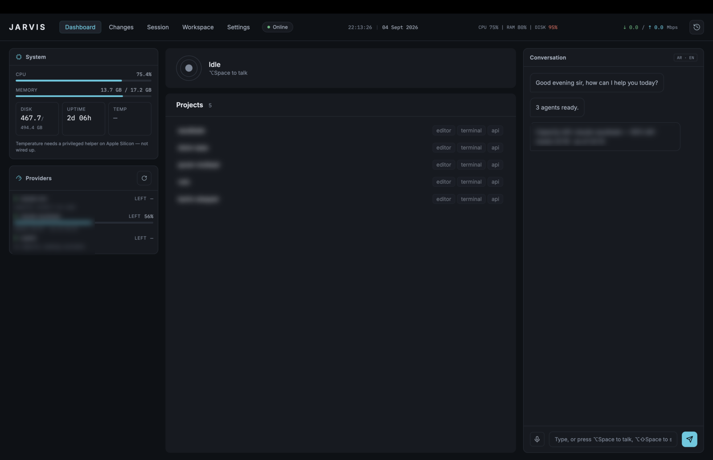
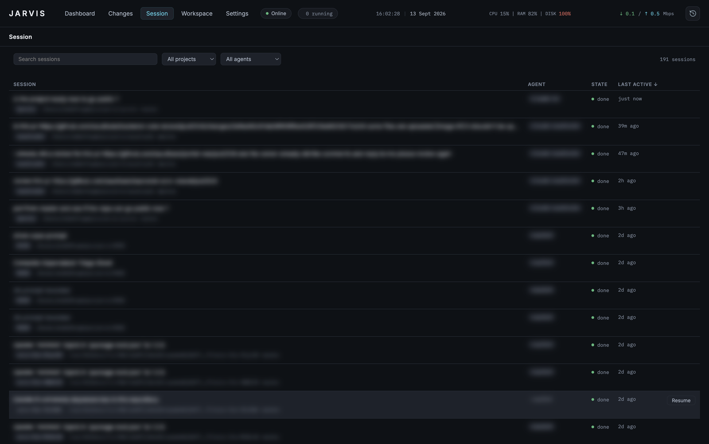

# The routes

Five, along the top. Only one is visible at a time, and the Workspace's hosted
pages are native views floating over the window — which is why leaving that
route explicitly hides them rather than merely covering them up.

Jarvis opens **full screen**: it is the surface you work from, not a panel
beside something else. Leaving full screen restores it to 1440×900.

## Dashboard

What every agent is doing, and what the machine is doing.

  

  Project names, provider accounts and capacity figures are blurred — everything else is the running app.

- **Sessions** — each running agent, its project, its model and its state.
- **Providers** — each configured account, whether it is reachable, and how
  much capacity is left. Every figure is read for free — never from a billed
  query: a Claude account from the snapshot its status-line hook writes
  (`scripts/claude-usage-snapshot.sh`, [Setup §5](../../SETUP.md#5-optional-tools)),
  Codex from the rate limits it records in its own session logs, Copilot
  from GitHub's quota endpoint through the signed-in `gh` (premium
  requests, resetting monthly, so its reset shows as a day). Each row says
  "as of HH:MM", when its figure was actually taken. Three different unknowns are reported as three different sentences,
  never collapsed into one "unknown": a provider that offers no capacity
  reading, one with no snapshot yet, and one not yet checked are distinct
  facts.
- **System** — CPU, memory and disk. Memory and disk are `total - available`,
  which is what `df` and Activity Monitor report; a platform's own `used`
  counts cached pages and reads near 100% on a healthy machine. Each reading is
  taken as often as it actually changes rather than every tick: CPU and network
  every two seconds, memory every six, disk and uptime every minute. Reading
  all of them every tick cost a tenth of a core permanently, most of it
  enumerating two dozen mounted volumes to answer a number that had not moved.
- **Conversation** and **History** — what has been said, and to whom.

## Changes

The working tree of a session's project: which files changed, the diff for
each (side by side or unified), staging, and committing.

A session that has ended still shows its repository's *current* state, and the
view says so — it is not a snapshot of what that agent did, and pretending
otherwise would be the more comfortable lie.

A row under the header carries the rest of the loop:

- **The branch picker** switches branch; **New branch** creates one from where
  you are and switches to it. Uncommitted changes come along, as they do with
  `git switch`, and git itself refuses a switch they would be lost in.
- **Where the branch stands** — `origin/main ↑2 ↓1` is two commits to push and
  one to pull; a branch that tracks nothing yet says so.
- **Pull** is fast-forward only. It never starts a merge or leaves conflicts
  in the tree; a branch that has diverged from its remote is reported, to be
  settled in the terminal.
- **Push** pushes the current branch, and a branch's first push goes to
  `origin` (or the only remote) and starts tracking it. It is never forced.
- **Pull request** opens the branch's open pull request, or creates one with
  `gh pr create --fill`, pushing first if the remote is missing commits. It
  opens in the project's own browser tab. It needs the
  [GitHub CLI](https://cli.github.com/), signed in.

A session running in a [worktree of its own](configuration.md) also gets
**Merge into** (the branch the project's main checkout has out) and **Remove
worktree** (once the session has ended; the branch is kept).

None of these ever waits on a password prompt: git and gh run with prompts
switched off, so a remote that needs credentials it does not have says so at
once instead of hanging. Credential helpers and SSH keys you already use work
as they do in your terminal.

## Session

One agent's real terminal, under a pty. Every byte the agent writes goes to
xterm.js untouched and every keystroke goes back untouched, which is what makes
slash commands, permission prompts and plan mode work at all.

  

  The table every session lands in, searchable and filterable by project and agent. Prompts, project names and agent accounts are blurred; the states and timestamps are the running app.

While this route is open, **⌥Space** talks to *this session* rather than to the
brain. The badge in the corner says so, because it is the one thing about voice
that the terminal itself cannot show.

## Workspace

A browser with tabs, per project — and the tabs are not only web pages. See
**[Workspace tabs](workspace-tabs.md)**.

## Settings

Every key of `jarvis.yaml`, edited in place: agents, routing, projects,
databases, editor roots, the brain, voice and Whisper. One **Save** for the whole file, one
validation pass, and a **Restart Jarvis** button afterwards — nothing is
applied live, because a save can change which agent answers and killing a
running session to apply it would be the wrong kind of helpful.

A per-agent **Test** button runs the health probe against the *draft* command
before it is ever saved.
